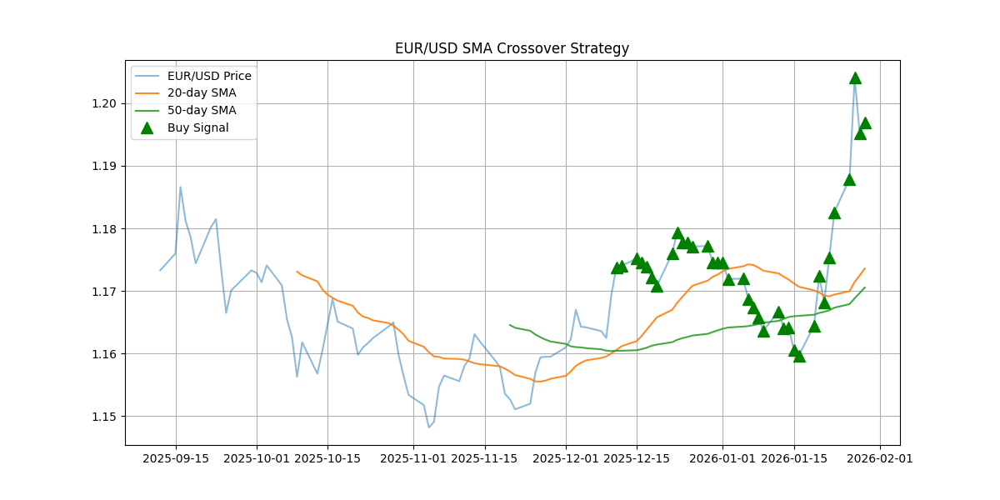

# Project 02: Trend-Following Strategy Backtest

## 📌 Executive Summary
This project implements a quantitative backtest of a **Simple Moving Average (SMA) Crossover** strategy. The goal is to evaluate the performance of trend-following signals on FX markets (EUR/USD) using historical daily data.

## 🛠 Strategy Logic
The algorithm utilizes a "Golden Cross" and "Death Cross" logic to determine market entry and exit points:
* **Fast SMA (20-day):** Captures short-term price momentum.
* **Slow SMA (50-day):** Establishes the long-term trend.
* **Buy Signal:** Triggered when the 20-day SMA crosses above the 50-day SMA.
* **Sell/Exit Signal:** Triggered when the 20-day SMA crosses below the 50-day SMA.

## 📊 Performance Analysis
The backtest was conducted on the most recent 100 days of EUR/USD price action.

| Metric | Value |
| :--- | :--- |
| **Total Returns (Market)** | 2.01% |
| **Total Returns (Strategy)** | 1.97% |
| **Under/Over Performance** | -0.04% |
| **Data Source** | Alpha Vantage API |

### Visual Results

## 🔍 Key Insights
1. **Whipsaw Effect:** The strategy slightly underperformed the benchmark due to "whipsawing" in a low-volatility environment where the moving averages crossed frequently without a sustained trend.
2. **Lagging Indicators:** As with all MA-based strategies, there is an inherent lag in signal generation, which was particularly visible in this 100-day sample.
3. **Execution Gap:** This model assumes zero transaction costs and instant execution at the closing price.

## 💻 Tech Stack
* **Language:** Python 3.11
* **Libraries:** `Pandas` (data manipulation), `NumPy` (vectorized math), `Matplotlib` (visualization).
* **Environment:** Termux (Linux) via Miniforge.

---
[← Back to Main Portfolio](../README.md)

